# ПЛАН ИСПРАВЛЕНИЯ: Passkey запрашивает NFC/USB вместо отпечатка пальца

## СРАВНИТЕЛЬНЫЙ АНАЛИЗ С ЭТАЛОННЫМ ПРОЕКТОМ

Изучен эталонный проект [`demo-webauthn-pubkey`](https://github.com/flancer64/demo-webauthn-pubkey) (файлы в `plans/пример правильного пасскея/`).

### Архитектурное различие

| Аспект | Эталонный проект | Наш проект |
|--------|-----------------|------------|
| **Клиентская библиотека** | `navigator.credentials.create()` **напрямую** | `@simplewebauthn/browser` v13 (`startRegistration`) |
| **Серверная библиотека** | `@flancer32/teq-ant-auth` (собственная) | `@simplewebauthn/server` v13 (`generateRegistrationOptions`) |
| **Построение опций** | `composeOptPkCreate({challenge, rpName, userId, userName, userUuid})` | Сервер генерирует полные опции → клиент модифицирует |
| **`authenticatorAttachment`** | **НЕ УСТАНОВЛЕН** (undefined) | `'platform'` (на сервере) |
| **`rp.id`** | Не передаётся (используется домен по умолчанию) | **УДАЛЯЕТСЯ** клиентом (!) |
| **`userVerification`** | `'preferred'` (дефолт в `composeOptPkCreate`) | `'preferred'` / `'required'` (разнится) |
| **`residentKey`** | `'preferred'` (дефолт в `composeOptPkCreate`) | `'preferred'` (сервер) / перезаписывается клиентом |
| **`transports`** | `['internal']` (дефолт в `composeOptPkCreate`) | Может быть `[]` (пустой) |

---

## КОРНЕВЫЕ ПРИЧИНЫ (уточнённые)

### 🔴 Причина 1 (САМАЯ КРИТИЧЕСКАЯ): Удаление `rp.id`

**Файл:** [`src/components/LoginScreen.tsx`](src/components/LoginScreen.tsx:689)

```typescript
if (adaptedOptions.rp && adaptedOptions.rp.id) {
    delete adaptedOptions.rp.id;  // ❌ ЭТОГО НЕТ В ЭТАЛОННОМ ПРОЕКТЕ
}
```

**Почему это проблема:**
- Эталонный проект: `rp: { name: 'WebAuthn Demo' }` — без явного `id`, браузер сам подставляет домен
- Наш проект: сервер возвращает `rp: { name: 'Syndicate', id: 'localhost' }`, а клиент удаляет `id`
- **Разница:** когда `rp.id` удаляется из уже сформированного JSON, `@simplewebauthn/browser` может некорректно обработать отсутствие поля (библиотека ожидает полную структуру `rp`)
- На Android Chrome это приводит к тому, что браузер не может сопоставить запрос с платформенным аутентификатором

**Исправление:** Полностью убрать блок удаления `rp.id`. Не модифицировать `rp`.

---

### 🔴 Причина 2: Перезапись `authenticatorSelection` с потерей `residentKey`

**Файл:** [`src/components/LoginScreen.tsx`](src/components/LoginScreen.tsx:675)

```typescript
// Сервер возвращает:
authenticatorSelection: {
    authenticatorAttachment: 'platform',
    residentKey: 'preferred',
    userVerification: 'preferred',
}

// Клиент перезаписывает (ТЕРЯЕТ residentKey!):
adaptedOptions.authenticatorSelection = {
    authenticatorAttachment: 'platform',
    userVerification: 'preferred'
};
```

**Почему это проблема:**
- Без `residentKey` браузер использует дефолт `'discouraged'`
- На некоторых Android-устройствах комбинация `authenticatorAttachment: 'platform'` + `residentKey: 'discouraged'` вызывает переключение на cross-platform аутентификатор
- Эталонный проект: `residentKey: 'preferred'` всегда присутствует

**Исправление:** Не перезаписывать `authenticatorSelection`. Использовать серверные настройки как есть.

---

### 🟠 Причина 3: `authenticatorAttachment` удаляется в SettingsModal

**Файл:** [`src/components/SettingsModal.tsx`](src/components/SettingsModal.tsx:383)

```typescript
delete adaptedOptions.authenticatorSelection.authenticatorAttachment;
```

**Почему это проблема:**
- Без `authenticatorAttachment` браузер показывает выбор между "This device" и "USB security key"
- На некоторых устройствах Chrome по умолчанию выбирает USB/NFC
- Эталонный проект: `authenticatorAttachment` не установлен, но `composeOptPkCreate` добавляет `transports: ['internal']` в `excludeCredentials`, что удерживает браузер на платформенном аутентификаторе

**Исправление:** Не удалять `authenticatorAttachment`. Оставить `'platform'`.

---

### 🟠 Причина 4: Пустой `transports` при сохранении credential

**Файл:** [`supabase/functions/webauthn-verify-registration/index.ts`](supabase/functions/webauthn-verify-registration/index.ts:58)

```typescript
transports: credential.transports || response.response?.transports || [],
```

**Почему это проблема:**
- Если `transports` пустой, при аутентификации `allowCredentials` содержит `transports: []`
- Пустой массив = «любой транспорт» → браузер показывает USB/NFC диалог
- Эталонный проект: `transports` всегда `['internal']` для платформенных аутентификаторов

**Исправление:** Если `transports` пустой, использовать `['internal']` как fallback.

---

### 🟡 Причина 5: `userVerification: 'required'` в SettingsModal и PinScreen

**Файлы:**
- [`src/components/SettingsModal.tsx`](src/components/SettingsModal.tsx:380)
- [`src/components/PinScreen.tsx`](src/components/PinScreen.tsx:58)

**Почему это проблема:**
- `'required'` требует ОБЯЗАТЕЛЬНОЙ верификации
- Если платформенный аутентификатор не может верифицировать → браузер переключается на cross-platform
- Эталонный проект: всегда `'preferred'`

**Исправление:** Заменить `'required'` → `'preferred'`.

---

### 🟡 Причина 6: `residentKey: 'required'` в SettingsModal

**Файл:** [`src/components/SettingsModal.tsx`](src/components/SettingsModal.tsx:378)

```typescript
adaptedOptions.authenticatorSelection.residentKey = 'required';
adaptedOptions.authenticatorSelection.requireResidentKey = true;
```

**Почему это проблема:**
- `'required'` требует discoverable credential
- Некоторые Android-устройства не поддерживают → браузер переключается на USB/NFC
- Эталонный проект: `'preferred'`

**Исправление:** Заменить `'required'` → `'preferred'`, убрать `requireResidentKey`.

---

## ПЛАН ИСПРАВЛЕНИЙ

### Шаг 1: LoginScreen.tsx — регистрация Passkey

**Файл:** [`src/components/LoginScreen.tsx`](src/components/LoginScreen.tsx:670-697)

1. ❌ **Удалить** блок удаления `rp.id` (строки 688-691)
2. ❌ **Удалить** перезапись `authenticatorSelection` (строки 675-678) — использовать серверные настройки
3. ❌ **Удалить** принудительную установку `pubKeyCredParams` (строки 681-683)
4. ❌ **Удалить** принудительный `timeout: 300000` (строка 686)
5. ✅ **Оставить** только удаление пустого `excludeCredentials` (строки 694-696)
6. ✅ **Вызывать** `startRegistration({ optionsJSON: options })` с оригинальными опциями сервера

### Шаг 2: LoginScreen.tsx — аутентификация Passkey

**Файл:** [`src/components/LoginScreen.tsx`](src/components/LoginScreen.tsx:813-817)

1. ❌ **Убрать** адаптацию `adaptedOptions` — использовать `options` как есть от сервера
2. ✅ **Вызывать** `startAuthentication({ optionsJSON: options })` без модификаций

### Шаг 3: SettingsModal.tsx — регистрация Passkey

**Файл:** [`src/components/SettingsModal.tsx`](src/components/SettingsModal.tsx:374-406)

1. **Попытка 1 (основная):**
   - ❌ Убрать `delete authenticatorAttachment`
   - ❌ Заменить `residentKey: 'required'` → `'preferred'`
   - ❌ Убрать `requireResidentKey: true`
   - ❌ Заменить `userVerification: 'required'` → `'preferred'`
   - ✅ Оставить `authenticatorAttachment: 'platform'`

2. **Попытка 2 (fallback):** использовать оригинальные `options` с сервера без изменений

3. **Попытка 3 (последний fallback):** `authenticatorAttachment: 'platform'` + `userVerification: 'preferred'`

### Шаг 4: PinScreen.tsx — аутентификация Passkey

**Файл:** [`src/components/PinScreen.tsx`](src/components/PinScreen.tsx:55-67)

1. ❌ **Заменить** `userVerification: 'required'` → `'preferred'`
2. ✅ **Использовать** `options` с сервера без модификаций (убрать adaptedOptions)

### Шаг 5: Сервер — сохранение transports

**Файл:** [`supabase/functions/webauthn-verify-registration/index.ts`](supabase/functions/webauthn-verify-registration/index.ts:54-61)

```typescript
// БЫЛО:
transports: credential.transports || response.response?.transports || [],

// СТАЛО:
transports: (credential.transports?.length ? credential.transports : 
             response.response?.transports?.length ? response.response.transports : 
             ['internal']),
```

### Шаг 6: Сервер — генерация опций аутентификации

**Файл:** [`supabase/functions/webauthn-generate-authentication-options/index.ts`](supabase/functions/webauthn-generate-authentication-options/index.ts:33-36)

```typescript
// БЫЛО:
allowCredentials: passkeys.map((credential: any) => ({
    id: credential.id,
    transports: credential.transports,
})),

// СТАЛО:
allowCredentials: passkeys.map((credential: any) => ({
    id: credential.id,
    transports: credential.transports?.length ? credential.transports : ['internal'],
})),
```

---

## СХЕМА: Эталонный проект vs Наш проект

```mermaid
flowchart TB
    subgraph Reference["Эталонный проект (работает)"]
        R1["composeOptPkCreate()"] --> R2["rp: { name: '...' }<br/>НЕТ rp.id"]
        R2 --> R3["authenticatorSelection:<br/>userVerification: 'preferred'<br/>residentKey: 'preferred'<br/>НЕТ authenticatorAttachment"]
        R3 --> R4["navigator.credentials.create()"]
        R4 --> R5["✅ Отпечаток пальца"]
    end

    subgraph Our["Наш проект (сломано)"]
        O1["generateRegistrationOptions()"] --> O2["rp: { name: '...', id: '...' }"]
        O2 --> O3["❌ delete rp.id"]
        O3 --> O4["authenticatorSelection:<br/>authenticatorAttachment: 'platform'<br/>❌ НЕТ residentKey"]
        O4 --> O5["@simplewebauthn/browser<br/>startRegistration()"]
        O5 --> O6["❌ NFC/USB ключ"]
    end

    style R5 fill:#4caf50,color:#fff
    style O6 fill:#f44336,color:#fff
```



---

## ПРОВЕРКА РЕЗУЛЬТАТА

После исправлений на **Android Chrome** должно происходить:
1. Регистрация: диалог «Use your screen lock» (отпечаток/PIN/графический ключ)
2. Аутентификация: сразу запрос отпечатка пальца

На **Desktop Chrome**:
1. Windows Hello / Touch ID

На **PWA** (Android):
1. Поведение идентичное Chrome